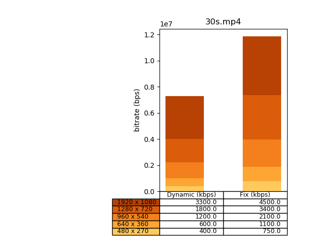

# Per-Title Analysis
*This a python package providing tools for optimizing your over-the-top (OTT) bitrate ladder per each video you need to encode.*

<p float="left">
  
  
</p>

## How does it work?
You can configure a template encoding ladder with constraints (min/max bitrate) that will be respected for the output optimal ladder and comparing it with the default bitrate.
You also have the control over analysis parameters (based on CRF encoding or multiple bitrate encodings with video quality metric assessments).

The CRF Analyzer
This analyzer calculates an optimal bitrate for the higher profile for a given CRF value.
Other profiles are declined top to bottom from the initial gap between each profiles of the template ladder (only if you use linear model).
Otherwise every optimal bitrates are calculated for each profil in "for_each" model.

The Metric Analyzer
This analyzer encodes multiple bitrates for each profile in the template ladder (from min to max, respecting a bitrate step defined by the user)
It then calculates video quality metrics for each of these encodings (only SSIM or PSNR for now).
The final optimized ladder will be constructed choosing for the best quality/bitrate ratio (similar to Netflix).
You can then use a super graph to analyze your results !


### The template encoding ladder
It is composed of multiple encoding profile object.
Each encoding profile is defined by those attributes:
- __width__ (int): Video definition width
- __height__ (int): Video definition height
- __bitrate_default__ (int): This should be the bitrate of your static encoding ladder
- __bitrate_min__ (int): This is the minimal bitrate you set for this profile in the output optimized encoding ladder
- __bitrate_max__ (int): This is the maximal bitrate you set for this profile in the output optimized encoding ladder
- __required__ (bool): Indicates if you authorize the script to remove this profile if considered not useful after optimization (conditions for this to happen are explained after)
- __bitrate_steps_individual__ (int): This is the bitrate step used for metric_analyzer only if you want to configure one step for each profile
- __bitrate_factor__ (float): this is a private attribute calculated after initialization of the template encoding ladder

##### See this template example
| width | height | bitrate_default | bitrate_min | bitrate_max | required | bitrate_steps_individual |
| --- | --- | --- | --- | --- | --- | --- |
| *in pixels* | *in pixels* | *in bits per second* | *in bits per second* | *in bits per second* | *bool* | *int bits per second* |
| 1920 | 1080 | 4500000 | 1000000 | 6000000 | True | 100000 |
| 1280 | 720 | 3400000 | 800000 | 5000000 | True | 100000 |
| 960 | 540 | 2100000 | 600000 | 4000000 | True | 100000 |
| 640 | 360 | 1100000 | 300000 | 3000000 | True | 100000 |
| 480 | 270 | 750000 | 200000 | 2000000 | False | 100000 |
| 480 | 270 | 300000 | 150000 | 2000000 | True | 100000 |
##### How configure it ?
- You can now play with this values.
- For example set the bitrate_default with your actual bitrate.
- Then set the Min and Max considering your network constraints or storage capacity
- If you need to keep one profile whatever happens set required to True.


#### In depth:
- How to choose the analysis parameters
- What is the multiple part analysis
- How is the weighted average bitrate calculated
- Documentation for the JSON ouput

___

##  Installation:
This is package requires at least Python 3.4

- You need to have ffmpeg and ffprobe installed on the host running the script.
- You need to have matplotlib and pylab to create the graphs


## Example:
Two examples using the CRF Analyzer method and the Metric Analyzer one are included in the per_title_analysis folder.

You can now use these scripts with the following command:
```bash
#command for CrfAnalyzer:

python3 crf_analyzer.py [path/my_movie.mxf] [CRF_value] [number_of_parts] [model]
#model: 1 (linear mode, only one profile is encoded, the higher) or 0 (for_each mode, each profile is encoded)
example : python3 crf_analyzer.py /home/xxxx/Documents/pertitleanalysis/Sources/my_movie.mxf 23 1 1

#command for MetricAnalyzer:

python3 metric_analyzer.py [path/my_movie.mxf] [metric] [limit_metric_value]
#metric: psnr or ssim
#limit_metric_value: To find the optimal bitrate we need to fix a limit of quality/bitrate_step ratio.
#we advise you to use for PSNR a limit of 0.09 (with bitrate_step = 100 kbps) and for SSIM a limit of 0.005 (with bitrate_step = 50 kbps)
example : python3 metric_analyzer.py /home/xxxx/Documents/pertitleanalysis/Sources/my_movie.mxf psnr 0.095


##### Code: A simple example for CRF Analysis
```python
# -*- coding: utf8 -*-

from pertitleanalysis import per_title_analysis as pta

# create your template encoding ladder
PROFILE_LIST = []
PROFILE_LIST.append(pta.EncodingProfile(1920, 1080, 4500000, 2000000, 6000000, True))
PROFILE_LIST.append(pta.EncodingProfile(1280, 720, 3400000, 1300000, 4500000, True))
PROFILE_LIST.append(pta.EncodingProfile(960, 540, 2100000, 700000, 300000, True))
PROFILE_LIST.append(pta.EncodingProfile(640, 360, 1100000, 300000, 2000000, True))
PROFILE_LIST.append(pta.EncodingProfile(480, 270, 750000, 300000, 900000, False))
PROFILE_LIST.append(pta.EncodingProfile(480, 270, 300000, 150000, 500000, True))
LADDER = pta.EncodingLadder(PROFILE_LIST)

# Create a new CRF analysis provider
ANALYSIS = pta.CrfAnalyzer("{{ your_input_file_path }}", LADDER)
# Launch various analysis
ANALYSIS.process(1, 1920, 1080, 23, 2)
ANALYSIS.process(10, 1920, 1080, 23, 2)

# Print results JSON
print(ANALYSIS.get_json())
```

##### JSON ouput:
```json
{
    "analyses": [
        {
            "average_bitrate": 3869192,
            "optimized_encoding_ladder": {
                "encoding_profiles": [
                    {
                        "bitrate": 3869192,
                        "bitrate_savings": 630808,
                        "height": 1080,
                        "width": 1920
                    },
                    {
                        "bitrate": 2923389,
                        "bitrate_savings": 476611,
                        "height": 720,
                        "width": 1280
                    },
                    {
                        "bitrate": 1805622,
                        "bitrate_savings": 294378,
                        "height": 540,
                        "width": 960
                    },
                    {
                        "bitrate": 945802,
                        "bitrate_savings": 154198,
                        "height": 360,
                        "width": 640
                    },
                    {
                        "bitrate": 644865,
                        "bitrate_savings": 105135,
                        "height": 270,
                        "width": 480
                    },
                    {
                        "bitrate": 257946,
                        "bitrate_savings": 42054,
                        "height": 270,
                        "width": 480
                    }
                ],
                "overall_bitrate_ladder": 10446816,
                "overall_bitrate_savings": 1703184
            },
            "optimal_bitrate": 3869192,
            "parameters": {
                "crf_value": 23,
                "height": 1080,
                "idr_interval": 2,
                "method": "CRF",
                "number_of_parts": 1,
                "part_duration": 60.0,
                "width": 1920
            },
            "processing_date": "2018-01-04 16:19:41.460371",
            "standard_deviation": null
        },
        {
            "average_bitrate": 3844318.1,
            "optimized_encoding_ladder": {
                "encoding_profiles": [
                    {
                        "bitrate": 4747733,
                        "bitrate_savings": -247733,
                        "height": 1080,
                        "width": 1920
                    },
                    {
                        "bitrate": 3587176,
                        "bitrate_savings": -187176,
                        "height": 720,
                        "width": 1280
                    },
                    {
                        "bitrate": 2100000,
                        "bitrate_savings": 0,
                        "height": 540,
                        "width": 960
                    },
                    {
                        "bitrate": 1160556,
                        "bitrate_savings": -60556,
                        "height": 360,
                        "width": 640
                    },
                    {
                        "bitrate": 791288,
                        "bitrate_savings": -41288,
                        "height": 270,
                        "width": 480
                    },
                    {
                        "bitrate": 316515,
                        "bitrate_savings": -16515,
                        "height": 270,
                        "width": 480
                    }
                ],
                "overall_bitrate_ladder": 12703268,
                "overall_bitrate_savings": -553268
            },
            "optimal_bitrate": 4747733.0,
            "parameters": {
                "crf_value": 23,
                "height": 1080,
                "idr_interval": 2,
                "method": "CRF",
                "number_of_parts": 10,
                "part_duration": 6.0,
                "width": 1920
            },
            "processing_date": "2018-01-04 16:20:32.904371",
            "standard_deviation": 1372795.7042960383
        }
    ],
    "template_encoding_ladder": {
        "encoding_profiles": [
            {
                "bitrate": 4500000,
                "constraints": {
                    "bitrate_factor": 1.0,
                    "bitrate_max": 6000000,
                    "bitrate_min": 2000000,
                    "required": true
                },
                "height": 1080,
                "width": 1920
            },
            {
                "bitrate": 3400000,
                "constraints": {
                    "bitrate_factor": 1.3235294117647058,
                    "bitrate_max": 4500000,
                    "bitrate_min": 1300000,
                    "required": true
                },
                "height": 720,
                "width": 1280
            },
            {
                "bitrate": 2100000,
                "constraints": {
                    "bitrate_factor": 2.142857142857143,
                    "bitrate_max": 2100000,
                    "bitrate_min": 700000,
                    "required": true
                },
                "height": 540,
                "width": 960
            },
            {
                "bitrate": 1100000,
                "constraints": {
                    "bitrate_factor": 4.090909090909091,
                    "bitrate_max": 2000000,
                    "bitrate_min": 300000,
                    "required": true
                },
                "height": 360,
                "width": 640
            },
            {
                "bitrate": 750000,
                "constraints": {
                    "bitrate_factor": 6.0,
                    "bitrate_max": 900000,
                    "bitrate_min": 300000,
                    "required": false
                },
                "height": 270,
                "width": 480
            },
            {
                "bitrate": 300000,
                "constraints": {
                    "bitrate_factor": 15.0,
                    "bitrate_max": 500000,
                    "bitrate_min": 150000,
                    "required": true
                },
                "height": 270,
                "width": 480
            }
        ],
        "overall_bitrate_ladder": 12150000
    },
    "input_file_path": "{{ your_input_file_path }}"
}
```
